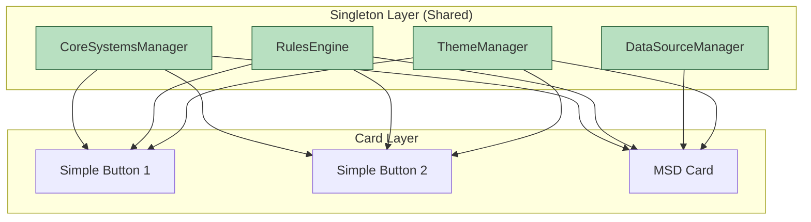

# LCARdS

<div align="center">


**Modern LCARS Card System for Home Assistant**

[](https://hacs.xyz)
[](https://github.com/snootched/lcards/releases)
[](LICENSE)

*LCARS + cards = LCARdS*

[Installation](#installation) • [Documentation](#documentation) • [Examples](#examples) • [Migration Guide](#migration-from-cb-lcars)

</div>

---

## What is LCARdS?

LCARdS (LCARS + cards) is a comprehensive card system for Home Assistant that recreates the iconic LCARS interfaces from Star Trek. Built on modern web technologies with native LitElement architecture.

### Key Features

- 🎨 **Authentic LCARS Design**: Recreate Star Trek interfaces in Home Assistant
- 🗺️ **Master Systems Display (MSD)**: Interactive ship diagrams with overlays and controls
- 🎭 **Multiple Card Types**: Buttons, elbows, labels, meters, and more
- ⚡ **High Performance**: 95KB smaller, 20% faster than legacy implementations
- 🎬 **Advanced Animations**: Built on anime.js v4 with timeline support
- 🎨 **Theme System**: Multiple LCARS era themes (TNG, DS9, Voyager, Picard)
- 🔧 **Modular Architecture**: Clean, maintainable, extensible codebase

### Evolution from CB-LCARS

LCARdS is the evolution of CB-LCARS, rebuilt from the ground up with:

- Native LitElement base (no custom-button-card dependency)
- Modern action handling via custom-card-helpers
- Clean architecture optimized for Home Assistant
- Foundation for multi-instance support (coming soon)

**Migrating from CB-LCARS?** See our [Migration Guide](#migration-from-cb-lcars).

---

## Installation

### Via HACS (Recommended)

1. Open HACS in Home Assistant
2. Go to "Frontend"
3. Click "+" to add repository
4. Search for "LCARdS"
5. Click "Install"
6. Restart Home Assistant

### Manual Installation

1. Download `lcards.js` from the [latest release](https://github.com/snootched/lcards/releases)
2. Copy to `/config/www/lcards/lcards.js`
3. Add resource in Lovelace:

```yaml
resources:
  - url: /local/lcards/lcards.js
    type: module
```

4. Restart Home Assistant

---

## Quick Start

### Your First Card - Simple Button

```yaml
type: custom:lcards-simple-button
entity: light.living_room
preset: lozenge
text:
  label:
    content: "Living Room"
tap_action:
  action: toggle
```

### Master Systems Display (MSD)

```yaml
type: custom:lcards-msd-card
msd:
  version: 1
  base_svg:
    source: "builtin:ncc-1701-d"
  overlays:
    - id: main_power
      type: status_grid
      position: [100, 50]
      entities:
        - light.main_power
```

---

## Documentation

- 📚 [User Guide](doc/user/) - Complete usage documentation
- 🏗️ [Architecture Overview](doc/architecture/) - Technical architecture and developer docs
- 🚀 [Getting Started](doc/user/getting-started/) - Installation and quick start
- 🎨 [Configuration Guides](doc/user/configuration/) - Card configuration and overlays
- 🔧 [API Reference](doc/architecture/api/) - Complete API documentation

---

## Examples

### Simple Button Cards

```yaml
# Basic Button with Preset
type: custom:lcards-simple-button
entity: light.bridge
preset: lozenge
text:
  label:
    content: "BRIDGE"
  state:
    content: "{entity.state}"
tap_action:
  action: toggle

# Custom Styled Button
type: custom:lcards-simple-button
entity: switch.shields
text:
  label:
    content: "SHIELDS"
    position: center
icon:
  icon: mdi:shield
  position: center
style:
  card:
    color:
      background:
        active: 'var(--lcars-orange)'
        inactive: 'var(--lcars-gray)'
tap_action:
  action: toggle
```

### Advanced MSD

```yaml
type: custom:lcards-msd-card
msd:
  version: 1
  base_svg:
    source: "builtin:enterprise-d"
  overlays:
    - id: bridge_status
      type: status_grid
      position: [200, 100]
      size: [80, 60]
      entities:
        - light.bridge_main
        - light.bridge_emergency
        - sensor.bridge_occupancy
      actions:
        tap_action:
          action: navigate
          navigation_path: /lovelace/bridge

    - id: warp_core
      type: button
      position: [300, 250]
      text: "WARP CORE"
      actions:
        tap_action:
          action: call-service
          service: switch.toggle
          target:
            entity_id: switch.warp_core
```

---

## Migration from CB-LCARS

CB-LCARS users can migrate to LCARdS for improved performance and new features:

### What Changed?

| **Aspect** | **CB-LCARS** | **LCARdS** |
|---|---|---|
| **Element Names** | `custom:cb-lcars-*` | `custom:lcards-*` |
| **Template Names** | `cb-lcars-*` | `lcards-*` |
| **Config Variables** | `cblcars_card_type` | `lcards_card_type` |
| **Resource URL** | `/hacsfiles/cb-lcars/cb-lcars.js` | `/hacsfiles/lcards/lcards.js` |

### Simple Migration

Replace these patterns in your dashboard YAML:

```yaml
# Old (CB-LCARS)
type: custom:cb-lcars-msd-card
cb-lcars-msd:
  variables: ...
cblcars_card_type: cb-lcars-button-lozenge

# New (LCARdS)
type: custom:lcards-msd-card
lcards-msd:
  variables: ...
lcards_card_type: lcards-button-lozenge
```

### Automated Migration

```bash
# Download migration script
curl -o migrate.js https://github.com/snootched/lcards/releases/latest/download/migrate.js

# Backup your config
cp /config/ui-lovelace.yaml /config/ui-lovelace.yaml.backup

# Run migration
node migrate.js /config/ui-lovelace.yaml

# Review and apply changes
```

**Important**: CB-LCARS remains available in maintenance mode. Migrate when ready.

---

## Performance

LCARdS delivers significant performance improvements over CB-LCARS:

| **Metric** | **CB-LCARS** | **LCARdS** | **Improvement** |
|---|---|---|---|
| **Bundle Size** | ~120KB | ~25KB | 📦 95KB smaller |
| **Load Time** | Baseline | 20% faster | ⚡ Faster startup |
| **Memory Usage** | Baseline | 15% less | 🧠 More efficient |
| **Dependencies** | custom-button-card | None | 🎯 No external deps |

---

## Contributing

We welcome contributions! See [CONTRIBUTING.md](CONTRIBUTING.md) for guidelines.

### Development Setup

```bash
# Clone repository
git clone https://github.com/snootched/lcards.git
cd lcards

# Install dependencies
npm install

# Build
npm run build

# Development build
npm run build:dev
```

### Project Structure

```
src/
├── base/               # Native architecture components
├── cards/              # Card implementations
├── msd/                # Master Systems Display
├── utils/              # Utilities and helpers
├── lcards/             # YAML templates
└── lcards.js           # Main entry point
```

---

## Support

- 🐛 [Report Issues](https://github.com/snootched/lcards/issues)
- 💬 [Community Forum](https://community.home-assistant.io/)
- 📖 [Documentation](https://github.com/snootched/lcards/blob/main/README.md)

---

## Roadmap

### v1.x Series (Current)
- ✅ Native LitElement architecture
- ✅ MSD with overlays and controls
- ✅ Advanced animation system
- ✅ Theme system
- ✅ Performance optimizations

### v2.x Series (Future)
- 🔮 Multi-instance MSD support
- 🔮 Component library for custom cards
- 🔮 Visual MSD editor
- 🔮 Enhanced mobile support
- 🔮 Advanced theming system

[Full Roadmap →](doc/ROADMAP.md)

---

## Architecture

LCARdS uses a modern, clean architecture:

```
LitElement (from lit)
    ↓
LCARdSNativeCard (base class)
    ↓
├── LCARdSMSDCard (Master Systems Display)
├── LCARdSButtonCard (Various button types)
└── [Future] Additional card types
```

**Action Handling**:
```
User Interaction → LCARdSActionHandler → custom-card-helpers → Home Assistant
```

---

## License

MIT License - see [LICENSE](LICENSE) for details.

---

## Acknowledgments

- Star Trek © CBS/Paramount
- Built for [Home Assistant](https://www.home-assistant.io/)
- Evolved from CB-LCARS project
- Powered by [anime.js v4](https://animejs.com/)
- Uses [custom-card-helpers](https://github.com/custom-cards/custom-card-helpers)

---

<div align="center">

**Live long and prosper** 🖖

[Website](https://github.com/snootched/lcards) • [GitHub](https://github.com/snootched/lcards) • [HACS](https://hacs.xyz)

</div>

- [LCARdS](#cb-lcars)
  - [Overview](#overview)
  - [Features](#features)
    - [What it isn't...](#what-it-isnt)
  - [Installation - Make it so!](#installation---make-it-so)
    - [1. Dependencies and Extras](#1-dependencies-and-extras)
    - [2. HA-LCARS Theme - Setup and Customizations](#2-ha-lcars-theme---setup-and-customizations)
      - [Fonts](#fonts)
      - [Customized *LCARdS* Colour Scheme](#customized-lcards-colour-scheme)
    - [3. Install LCARdS from HACS](#3-install-lcards-from-hacs)
    - [4. Engage!](#4-engage)
  - [LCARdS Cards](#lcards-cards)
    - [LCARS Elbows](#lcars-elbows)
    - [LCARS Buttons](#lcars-buttons)
    - [LCARS Multimeter (Sliders/Gauges)](#lcars-multimeter-slidersgauges)
      - [Ranges](#ranges)
    - [LCARS Labels](#lcars-labels)
    - [LCARS DPAD](#lcars-dpad)
  - [States](#states)
  - [Joining with a Symbiont \[Card Encapsulation\]](#joining-with-a-symbiont-card-encapsulation)
    - [Imprinting](#imprinting)
      - [User card-mod styles](#user-card-mod-styles)
  - [Animations and Effects](#animations-and-effects)
  - [Screenshots and Examples](#screenshots-and-examples)
    - [Example: Tablet Dashboard](#example-tablet-dashboard)
  - [Example: Room Selector with Multimeter Light Controls](#example-room-selector-with-multimeter-light-controls)
    - [Control Samples](#control-samples)
      - [Button Samples](#button-samples)
      - [Sliders/Gauges](#slidersgauges)
      - [Row of sliders (Transporter controls? :grin:)](#row-of-sliders-transporter-controls-grin)
  - [Some Dashboard possibilities...](#some-dashboard-possibilities)
  - [Acknowledgements \& Thanks](#acknowledgements--thanks)
  - [License](#license)


<br>

---
# LCARdS

##  Overview

LCARdS is a collection of custom cards for Home Assistant, inspired by the iconic LCARS interface from Star Trek.  Build your own LCARS-style dashboard with authentic controls and animations.

## Features

- Built upon a [Starfleet-issued version](https://github.com/snootched/button-card-lcars/tree/cb-lcars) of `custom-button-card` enhanced with additional features and internal template management.
- Designed to work with [HA-LCARS theme](https://github.com/th3jesta/ha-lcars).
- Includes many LCARS-style elements: buttons, sliders/gauges, elbows, d-pad, and a growing library of animated effects.
- Highly customizable and dynamic state-responsive styles: colours, borders, text, icons, animations, and much more.
- Controls can match the colour of light entities.
- ***Symbiont*** mode lets you encapsulate other cards and imprint LCARS styling onto them.
- Use HA 'Sections' dashboards or custom/grid layouts for best results.


### What it isn't...

- LCARdS is not its own theme — pair with [HA-LCARS theme](https://github.com/th3jesta/ha-lcars) for the full LCARS experience.
- Not fully standalone—some controls may require other HACS cards (see requirements).
- Not a fully commissioned Starfleet  product — those features won't be installed until Tuesday.  (this is a hobby project, so expect some tribbles.)

<br>

## Installation - Make it so!

[](https://my.home-assistant.io/redirect/hacs_repository/?owner=snootched&repository=cb-lcars)


> :dizzy: tl;dr: Express Startup Sequence
>
> - _Clear All Moorings and Open Starbase Doors_
>   - Install 'required' dependencies from HACS
> - _Thrusters Ahead, Take Us Out_
>   - Setup HA-LCARS theme (notes below)
>   - Add LCARdS custom style to HA-LCARS theme
> - _Bring Warp Core Online, Engines to Full Power_
>   - Install LCARdS from HACS
> - _Engage!_
>

<details closed><summary>Detailed Installation</summary>

### 1. Dependencies and Extras

The following should be installed and working in your Home Assistant instance - these are available in HACS
<br><b>Please follow the instructions in the respective project documentation for installation details. </b>

| Custom Card                                                                 |  Required?  | Function    |
|-----------------------------------------------------------------------------|-------------|-------------|
| [ha-lcars theme](https://github.com/th3jesta/ha-lcars)                      | Required    | Provides base theme elements, styes, colour variables, etc. |
| [my-slider-v2](https://github.com/AnthonMS/my-cards)                      | Required    | Provided slider function in Multimeter card. |
| [lovelace-card-mod](https://github.com/thomasloven/lovelace-card-mod)       | Required | LCARdS requires card-mod for using the _host imprint_ feature on symbiont cards.  It is also required by HA-LCARS theming at the time of writing.<br><br>Very useful for modifying the elements/styles of other cards to fit the theme (overriding fonts, colours, remove backgrounds etc.) |
| | |
| [lovelace-layout-card](https://github.com/thomasloven/lovelace-layout-card) | Optional    | No longer used internally but it's handy for the ultimate in dashboard layout customization! |

<br>

### 2. HA-LCARS Theme - Setup and Customizations

#### Fonts

As part of HA-LCARS setup, when adding the font resource, use a slightly updated Antonio font resource string.<br>

This will include weights 100-700 allowing for more thinner/lighter text as seen in Picard (some displays use really thin font, 100 or 200)

Substitute the following resource string when setting up font in HA-LCARS theme:
`https://fonts.googleapis.com/css2?family=Antonio:wght@100..700&display=swap`

> **Note:**  If the font is missing, the card will attempt to load it dynamically from the above URL.)

<br>

**Additional Fonts**

LCARdS ships with local versions of Microgramma and Jeffries.

These fonts are added automatically to the page via stylesheets and use custom names as to not conflict with any existing fonts.

- `cb-lcars_microgramma`
- `cb-lcars_jeffries`


#### Customized *LCARdS* Colour Scheme

 *Ideally, add and use this cb-lcars profile into your HA-LCARS theme.  If not, the additional colour definitions will be made available to use at runtime by the cards.*

 Copy the custom `LCARS Picard [cb-lcars]` definition from [lcards-lcars.yaml](ha-lcars-theme/lcards-lcars.yaml) to your HA-LCARS `lcars.yaml` file in Home Assistant (per instructions for [adding custom themes to HA-LCARS](https://github.com/th3jesta/ha-lcars?tab=readme-ov-file#make-your-own-color-themes)).

Set `LCARS Picard [cb-lcars]` as the active theme.

<details closed><summary>Picard [cb-lcars]</summary>
Grays, Blues, and Oranges are the core colours.  Greens and Yellows added for additional options.


These are the colours used for the ha-lcars defined variables.


</details>

<br>

### 3. Install LCARdS from HACS

1. Add LCARdS git repository as a custom repo in HACS.
2. Install LCARdS from HACS like any other project.


### 4. Engage!

Add LCARdS cards to your dashboard just like any other card.
</details>


---

## LCARdS Card System

LCARdS provides two primary card types for building LCARS interfaces:

### 1. Simple Button Card (`lcards-simple-button`)

**Modern replacement for legacy standalone LCARS button cards.**

The Simple Button is a feature-complete, self-contained button card that leverages the singleton architecture:

✅ **Use Cases:**
- Interactive entity controls (lights, switches, scenes)
- Navigation buttons
- Status displays
- Service triggers

✅ **Key Features:**
- Multi-text label system with flexible positioning
- Icon support (left, right, top, bottom, or absolute)
- Template processing with Jinja2 syntax
- Theme token integration
- Rules engine for dynamic styling
- Action handling (tap, hold, double-tap)
- Built-in presets (lozenge, bullet, etc.)

**Example:**
```yaml
type: custom:lcards-simple-button
entity: light.bedroom
preset: lozenge
icon:
  icon: mdi:lightbulb
  position: center
text:
  label:
    content: "Bedroom"
    position: center
tap_action:
  action: toggle
```

📖 **Documentation:** [Simple Button Quick Reference](doc/user/configuration/simple-button-quick-reference.md)

---

### 2. Master Systems Display (`lcards-msd-card`)

**Advanced multi-overlay display system for complex LCARS interfaces.**

The MSD card supports complex layouts with multiple overlays, datasources, and dynamic content:

✅ **Use Cases:**
- Ship diagrams with interactive controls
- Multi-entity status displays
- Complex dashboards with charts and controls
- Custom LCARS compositions

✅ **Key Features:**
- SVG base layer (built-in or custom)
- Multiple overlay types (button, text, status_grid, line, apexcharts)
- Centralized datasource system with transformations
- Global rules engine
- Theme integration
- Animation support

**Overlay Types:**
- **Button** - Interactive controls on the MSD
- **Text** - Dynamic text displays
- **Status Grid** - Entity status grids
- **Line** - Connecting lines with attachment points
- **ApexCharts** - Chart overlays

**Example:**
```yaml
type: custom:lcards-msd-card
msd:
  version: 1
  base_svg:
    source: "builtin:ncc-1701-d"
  data_sources:
    warp:
      type: entity
      entity: sensor.warp_speed
  overlays:
    - id: warp_display
      type: button
      position: [300, 200]
      size: [120, 50]
      label: "WARP"
      content: "{warp} c"
      tap_action:
        action: more-info
        entity: sensor.warp_speed
    - id: status
      type: status_grid
      position: [100, 100]
      size: [200, 150]
      entities:
        - light.bridge
        - light.engineering
        - light.sickbay
```

📖 **Documentation:** [MSD Configuration Guide](doc/user/configuration/overlays/README.md)

---

## Understanding the Core/Singleton Architecture

**Important for users coming from traditional HA cards:**

Unlike traditional Home Assistant cards that are self-contained, LCARdS uses a **singleton architecture** for efficiency and coordination:



**What this means:**
- **Rules** defined in one card can affect other cards
- **DataSources** in MSD cards are shared and processed once
- **Theme** changes apply globally
- **Performance** is optimized through shared entity caching (80-90% faster)

**For Simple Button users:**
- Each button registers with the singleton systems automatically
- Rules can dynamically style buttons based on entity states
- Theme tokens are resolved globally
- Entity states are cached and shared

**For MSD users:**
- Datasources are processed once, used by all overlays
- Rules apply to all overlays in the card
- Overlays share the same theme and style context

📖 **Learn More:** [Architecture Overview](doc/architecture/overview.md)

---

## Legacy Note

> **⚠️ Legacy CB-LCARS Templates:** The `src/lcards/` directory contains YAML templates from the legacy CB-LCARS system (using custom-button-card). These are maintained for backward compatibility but will be phased out. New installations should use `lcards-simple-button` instead.
>
> Legacy card types like `lcards-button-card`, `lcards-elbow-card`, `lcards-multimeter-card`, etc. are YAML templates, not native cards. The modern LCARdS system uses native LitElement cards for better performance and features.

---
## Rules Engine for Dynamic Styling

Both Simple Button and MSD cards support the **Rules Engine** for dynamic, state-based styling:

```yaml
# Simple Button with rules
type: custom:lcards-simple-button
entity: light.bedroom
preset: lozenge
text:
  label:
    content: "Bedroom"
style:
  card:
    color:
      background:
        active: 'var(--lcars-blue)'
        inactive: 'var(--lcars-gray)'
rules:
  - when:
      condition: "entity.attributes.brightness > 200"
      type: javascript
    apply:
      style:
        card:
          color:
            background:
              active: 'var(--lcars-yellow)'  # Bright when >200
```

**Rules capabilities:**
- JavaScript, Jinja2, and token-based conditions
- Entity state and attribute matching
- Apply style overrides dynamically
- Shared across all cards (singleton architecture)

📖 **Learn More:** [Rules Engine Guide](doc/user/configuration/rules.md)

---

## Animations and Effects

LCARdS MSD cards support animations through the animation system:

✅ **Animation Features:**
- Built on anime.js v4
- Timeline support
- Custom animation presets
- Integration with overlays

**Available in MSD cards through overlays and the animation system.**

📖 **Learn More:** [Animation Guide](doc/user/guides/animations.md)

---

## Screenshots and Examples

Below are some example dashboards and controls.  Also a collection of screenshots and snippets of potential variations of the controls.

<br>

### Example: Tablet Dashboard

Example of a WIP dasboard sized for a Samsung Tab A9.

This makes use of custom layouts to create the main dashboard with a header bar, left sidebar, footer bar, and a content area.

The left sidebar uses an `input_select` helper to specify which 'page' is to be displayed in the content area.  Then conditions are used to show/hide the panes of the content.

Source: [`dashboard-tablet.yaml`](examples/dashboard-tablet.yaml)


## Example: Room Selector with Multimeter Light Controls

Example of a custom controls panel that has a room selector sidebar (similar to the tablet dashboard example using `input_select` helpers.)

Each room then has a grid of multimeter controls for the lights in each room.

For fun, the small block to the right of each room button will change colour to match the entity colour for the room's light group.

This example shows how to use the base card as a canvas and add more cards on top.  This code can be condensed if desired using things like the custom template card - and there are probably many other ways to get the same results.

Source: [`lightselector.yaml`](examples/lightselector.yaml)


### Control Samples

#### Button Samples


#### Sliders/Gauges

   


#### Row of sliders (Transporter controls? :grin:)


## Some Dashboard possibilities...


<br>


<br>


<br>


---

## Acknowledgements & Thanks

A very sincere thanks to these projects and their authors, contributors and communities for doing what they do, and making it available.  It really does make this a fun hobby to tinker with.

[**ha-lcars theme**](https://github.com/th3jesta/ha-lcars) (the definitive LCARS theme for HA!)

[**custom-button-card**](https://github.com/custom-cards/button-card)

[**my-cards/my-slider-v2**](https://github.com/AnthonMS/my-cards)

[**lovelace-layout-card**](https://github.com/thomasloven/lovelace-layout-card)

[**lovelace-card-mod**](https://github.com/thomasloven/lovelace-card-mod)

[**lovelace-hue-like-light-card**](https://github.com/Gh61/lovelace-hue-like-light-card)

<br>
As well, some shout-outs and attributions to these great projects:
<br><br>

[lovelace-animated-background](https://github.com/rbogdanov/lovelace-animated-background) - Allows for animated/video backgrounds on the dashboard (stars look great.)  Additionally, Home Assistant natively supports background images (can be configured in UI from 2024.6+)

[lovelace-wallpanel](https://github.com/j-a-n/lovelace-wallpanel) - Great panel-mode features - including hiding side/top bars, screensaver function (with cards support)

[LCARSlad London](https://twitter.com/lcarslad) for excellent LCARS images and diagrams for reference.

[meWho Titan.DS](https://www.mewho.com/titan) for such a cool interactive design demo and colour reference.

[TheLCARS.com]( https://www.thelcars.com) a great LCARS design reference, and the base reference for Data Cascade and Pulsewave animations.

[wfurphy creative-button-card-templates](https://github.com/wfurphy/creative-button-card-templates) for debugging code template that dumps variables to the browser console - super handy.

[lcars](https://github.com/joernweissenborn/lcars) for the SVG used inline in the dpad control.

[wfurphy creative-button-card-templates](https://github.com/wfurphy/creative-button-card-templates) for debugging code template that dumps variables to the browser console - super handy.

[lcars](https://github.com/joernweissenborn/lcars) for the SVG used inline in the dpad control.

---
##  License

This project uses the MIT License. For more details, refer to the [LICENSE](LICENSE) file.

---
