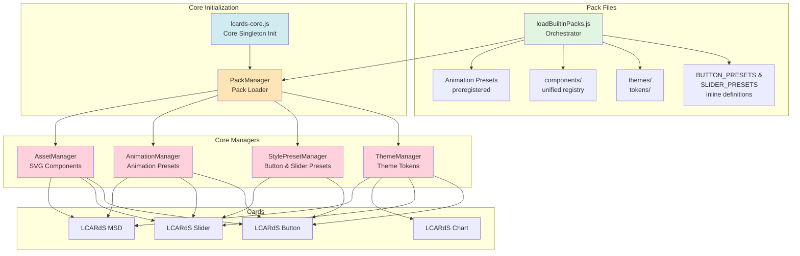
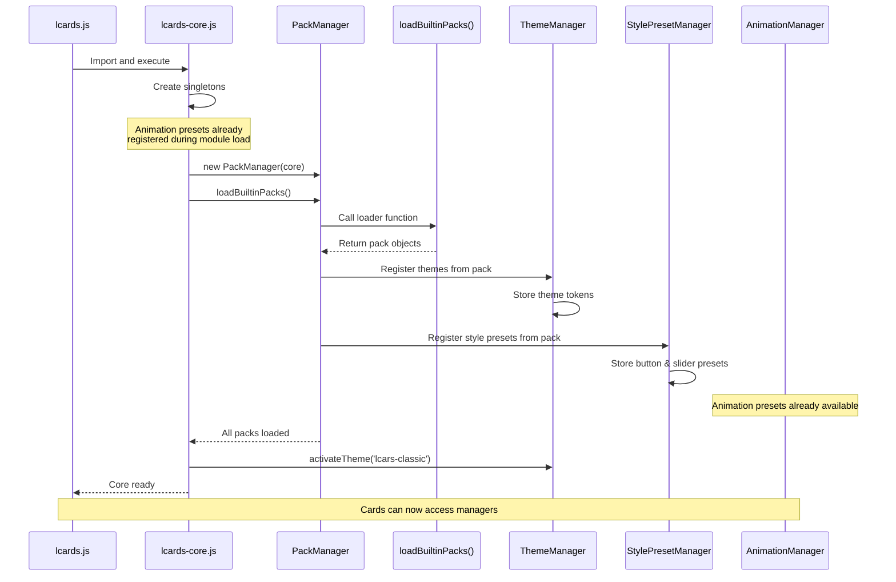

# LCARdS Pack System - Developer Guide

**Version:** 1.23.0  
**Status:** ✅ Production Ready  
**Last Updated:** January 13, 2026

> **Recent Changes**: PR #195 (January 12, 2026) standardized all components to use unified inline SVG format, eliminating the legacy shapes registry. All component examples in this guide reflect the current unified structure.

## Overview

The LCARdS Pack System is a modular framework for distributing **themes**, **style presets**, **components**, and **animation presets** to cards. Think of it as a plugin architecture where each pack provides reusable building blocks.

```
Packs → Core Managers → Cards
```

**Key Principle**: Packs are loaded **once** at core initialization. Cards consume from singleton managers, never load packs directly.

---

## Architecture Diagram



---

## Pack System Components

### 1. Pack Files (Source Data)

**Location**: `src/core/packs/loadBuiltinPacks.js` (main orchestrator)

**Structure**:
```
src/core/
├── packs/
│   ├── loadBuiltinPacks.js    # Pack definitions + orchestrator (1,189 lines)
│   ├── components/             # SVG components (unified format, inline SVG)
│   │   ├── buttons/
│   │   │   └── index.js        # Button component metadata
│   │   ├── sliders/
│   │   │   ├── picard-vertical.js
│   │   │   └── index.js        # Slider component metadata
│   │   ├── dpad/
│   │   │   └── index.js        # D-pad component (9-segment)
│   │   ├── index.js            # Unified component registry
│   │   └── README.md           # Component system documentation
│   ├── externalPackLoader.js  # External pack loading
│   └── mergePacks.js           # Pack merging utilities
├── themes/
│   └── tokens/                 # Theme token files
│       ├── lcarsClassicTokens.js
│       ├── lcarsDs9Tokens.js
│       ├── lcarsVoyagerTokens.js
│       └── lcarsHighContrastTokens.js
└── animation/
    └── presets.js              # Animation preset registration
```

**Note**: As of PR #195, the legacy shapes registry was removed. All components now use unified inline SVG format with consistent structure.

**Pack Structure Example**:
```javascript
// LCARDS_BUTTONS_PACK (from loadBuiltinPacks.js)
{
  id: 'lcards_buttons',
  version: '1.14.18',
  description: 'Button style presets',
  style_presets: {
    button: {
      base: { /* base button config */ },
      lozenge: { extends: 'button.base', /* ... */ },
      bullet: { extends: 'button.lozenge', /* ... */ },
      // ... more presets
    }
  }
}
```

---

### 2. Pack Loader (Orchestrator)

**File**: `src/core/packs/loadBuiltinPacks.js`

**Responsibilities**:
- Define pack objects with inline style presets
- Import theme tokens from `src/core/themes/tokens/`
- Import component registry from `src/core/packs/components/`
- Return pack objects for PackManager registration

**Code**:
```javascript
import { lcarsClassicTokens } from '../themes/tokens/lcarsClassicTokens.js';
import { lcarsDs9Tokens } from '../themes/tokens/lcarsDs9Tokens.js';
import { lcarsVoyagerTokens } from '../themes/tokens/lcarsVoyagerTokens.js';
import { lcarsHighContrastTokens } from '../themes/tokens/lcarsHighContrastTokens.js';
import * as componentsRegistry from './components/index.js';

// Pack definitions with inline style presets
const LCARDS_BUTTONS_PACK = {
  id: 'lcards_buttons',
  version: '1.14.18',
  style_presets: {
    button: {
      base: { /* ... */ },
      lozenge: { /* ... */ },
      bullet: { /* ... */ }
    }
  }
};

const BUILTIN_THEMES_PACK = {
  id: 'builtin_themes',
  version: '1.0.0',
  themes: {
    'lcars-classic': {
      id: 'lcars-classic',
      tokens: lcarsClassicTokens
    }
  },
  defaultTheme: 'lcars-classic'
};

export function loadBuiltinPacks(requested = ['core', 'lcards_buttons', 'lcards_sliders']) {
  // Always include builtin_themes
  const packsToLoad = [...new Set([...requested, 'builtin_themes'])];
  
  return packsToLoad.map(id => BUILTIN_REGISTRY[id]).filter(Boolean);
}
```

**Note**: Animation presets are pre-registered in `src/core/animation/presets.js` during module load, **before** packs are loaded.

---

### 3. Core Managers (Consumption Layer)

**File**: `src/core/lcards-core.js`

**Initialization Flow**:
```javascript
// 1. Create core singletons
this.systemsManager = new CoreSystemsManager();
this.dataSourceManager = new DataSourceManager(hass);
this.rulesManager = new RulesEngine();
this.themeManager = new ThemeManager();
this.animationManager = new AnimationManager(null);
this.validationService = new CoreValidationService();
this.stylePresetManager = new StylePresetManager();
this.animationRegistry = new AnimationRegistry();
this.actionHandler = new LCARdSActionHandler();
this.assetManager = new AssetManager();

// 2. Create PackManager and load builtin packs (happens ONCE)
this.packManager = new PackManager(this);
await this.packManager.loadBuiltinPacks(['core', 'lcards_buttons', 'lcards_sliders', 'lcars_fx', 'builtin_themes']);

// 3. Activate default theme
await this.themeManager.activateTheme('lcars-classic');
```

**What Each Manager Does**:

| Manager | Registers From Packs | Provides To Cards |
|---------|---------------------|-------------------|
| **ThemeManager** | `pack.themes` | `getToken()`, `getActiveTheme()` |
| **StylePresetManager** | `pack.style_presets` | `getPreset('button', 'lozenge')` |
| **AnimationManager** | Animation preset functions | `play()`, animation coordination |
| **AnimationRegistry** | Animation instances | Animation caching and reuse |
| **AssetManager** | Component registry | `get('svg', 'component-name')` |

---

### 4. Cards (Consumers)

**Pattern**:
```javascript
export class LCARdSButton extends LCARdSCard {
  async _initialize() {
    // Access core singletons
    const core = window.lcards?.core;
    
    // Get style preset from pack
    if (this.config.preset) {
      const preset = core.stylePresetManager.getPreset('button', this.config.preset);
      // Apply preset styles...
    }
    
    // Get theme token
    const bgColor = core.themeManager.getToken('components.button.background.active');
    
    // Play animation from pack
    if (this.config.animations) {
      core.animationManager.play({
        preset: 'pulse',  // From builtin animation presets
        trigger: 'on_load'
      });
    }
  }
}
```

---

## Pack Contents Deep Dive

### Style Presets (Button & Slider)

**Purpose**: Named style bundles that cards apply via `preset: "name"`

**Location**: Defined inline in `src/core/packs/loadBuiltinPacks.js`

**Example**:
```javascript
// From loadBuiltinPacks.js - BUTTON_PRESETS
style_presets: {
  button: {
    lozenge: {
      extends: 'button.base',
      border: {
        radius: {
          top_left: 'theme:components.button.radius.full',
          top_right: 'theme:components.button.radius.full',
          bottom_left: 'theme:components.button.radius.full',
          bottom_right: 'theme:components.button.radius.full'
        }
      },
      text: {
        name: {
          position: 'bottom-right',
          padding: { right: 24 }
        }
      }
    }
  }
}
```

**Card Usage**:
```yaml
type: custom:lcards-button
preset: lozenge  # ← Applies preset from pack
entity: light.bedroom
```

**Resolution**: `StylePresetManager.getPreset('button', 'lozenge')` → returns merged preset object

---

### Themes (Token-Based Styling)

**Purpose**: Provide token-based defaults for components

**Location**: `src/core/themes/tokens/` (imported by loadBuiltinPacks.js)

**Example**:
```javascript
// src/core/packs/loadBuiltinPacks.js
import { lcarsClassicTokens } from '../themes/tokens/lcarsClassicTokens.js';

export const BUILTIN_THEMES_PACK = {
  themes: {
    'lcars-classic': {
      id: 'lcars-classic',
      name: 'LCARS Classic',
      description: 'Classic TNG-era LCARS styling',
      tokens: lcarsClassicTokens  // Token object
    }
  },
  defaultTheme: 'lcars-classic'
};
```

**Token Structure**:
```javascript
// src/core/themes/tokens/lcarsClassicTokens.js
export const lcarsClassicTokens = {
  colors: {
    accent: { primary: 'var(--lcars-orange)' }
  },
  components: {
    button: {
      background: {
        active: 'var(--lcars-orange)',
        inactive: 'var(--lcars-gray)'
      },
      radius: {
        full: 34,
        large: 20,
        none: 0
      }
    }
  },
  typography: {
    fontSize: {
      base: 16,
      '2xl': 24
    },
    fontFamily: {
      primary: 'Antonio, sans-serif'
    }
  }
};
```

**Card Usage**:
```javascript
const bgColor = themeManager.getToken('components.button.background.active');
// Returns: 'var(--lcars-orange)'
```

**Special**: Chart animation presets also live in themes pack (ApexCharts-specific)

---

### Animation Presets (Anime.js)

**Purpose**: Pre-built animation functions for anime.js v4

**Location**: `src/core/animation/presets.js`

**Registration**: Animation presets are registered during module load, **before** pack loading

**Example**:
```javascript
// src/core/animation/presets.js
registerAnimationPreset('pulse', (def) => {
  const p = def.params || def;
  return {
    anime: {
      scale: [1, p.max_scale || 1.15],
      filter: [`brightness(1)`, `brightness(${p.max_brightness || 1.4})`],
      duration: p.duration || 1200,
      easing: p.easing || 'easeInOutSine',
      loop: p.loop !== undefined ? p.loop : true,
      alternate: p.alternate !== undefined ? p.alternate : true
    },
    styles: {
      transformOrigin: 'center'
    }
  };
});
```

**Available Presets** (from presets.js):
- `pulse` - Breathing effect with scale and brightness
- `fade` - Opacity transition
- `glow` - Brightness and box-shadow pulsing
- `draw` - SVG path drawing animation
- `march` - Marching animation effect
- `blink` - Rapid on/off blinking
- `shimmer` - Subtle shimmer effect
- `strobe` - Strobe light effect
- `flicker` - Random flicker animation
- `cascade` - Cascading animation
- `cascade-color` - Color cascade effect
- `ripple` - Ripple effect
- `scale` - Scale transformation
- `scale-reset` - Scale with reset to original
- `set` - Set properties directly (no animation)
- `motionpath` - Follow motion path

**Card Usage**:
```yaml
type: custom:lcards-button
entity: light.bedroom
animations:
  - preset: pulse     # ← From animation presets
    trigger: on_hover
    max_scale: 1.2
    duration: 1000
```

**Resolution**: `AnimationManager.play()` → calls `getAnimationPreset('pulse')` → executes preset function

---

### Components (SVG Shells)

**Purpose**: SVG-based visual shells for cards using unified inline SVG format

**Location**: `src/core/packs/components/`

**Structure** (unified format as of PR #195):
```
components/
├── buttons/
│   └── index.js        # Button component metadata
├── sliders/
│   ├── picard-vertical.js
│   └── index.js        # Slider component metadata
├── dpad/
│   └── index.js        # D-pad component (inline SVG)
├── index.js            # Unified component registry
└── README.md           # Component system documentation
```

**Unified Component Format** (all components use this structure):
```javascript
// Components now use inline SVG with metadata
export const dpadComponents = {
  'dpad': {
    svg: `<svg>...</svg>`,           // Inline SVG (no external shapes)
    orientation: 'auto',              // Layout handling
    features: ['interactive'],        // Component capabilities
    name: 'D-Pad Control',
    description: '9-segment directional control',
    category: 'navigation',
    segments: {                       // Pre-configured segments with theme tokens
      'up': { fill: 'theme:colors.accent.primary' },
      'down': { fill: 'theme:colors.accent.primary' },
      // ... more segments
    }
  }
};
```

**Component Registry** (`components/index.js`):
```javascript
import { dpadComponents } from './dpad/index.js';
import { sliderComponents } from './sliders/index.js';

export const components = {
  ...dpadComponents,    // D-Pad components
  ...sliderComponents   // Slider components (basic, picard, picard-vertical)
};
```

**Key Change**: Legacy shapes registry removed in PR #195. All components now use unified inline SVG format.

**Card Usage**:
```yaml
type: custom:lcards-button
component: lozenge  # ← SVG component from pack
```

**Resolution**: `AssetManager.get('button', 'lozenge')` → returns component metadata

---

## Initialization Sequence



**Critical Points**:
1. **Animation presets register first** during module load (`presets.js`)
2. **Packs load ONCE** during core initialization (line 202 in lcards-core.js)
3. **Themes, style presets, components** registered via PackManager
4. **Default theme activated** after pack loading
5. **Cards access** via `window.lcards.core.<manager>`

---

## Card Consumption Pattern

### Button Card Example

```javascript
export class LCARdSButton extends LCARdSCard {
  async _initialize() {
    super._initialize();
    
    const core = window.lcards?.core;
    
    // 1. Get style preset from pack
    if (this.config.preset) {
      const preset = core.stylePresetManager.getPreset('button', this.config.preset);
      this._mergedConfig = deepMerge(preset, this.config);
    }
    
    // 2. Get component from pack (via AssetManager)
    if (this.config.component) {
      const component = core.assetManager.get('button', this.config.component);
      this._component = component;
    }
    
    // 3. Resolve theme tokens
    this._backgroundColor = core.themeManager.getToken('components.button.background.active');
  }
  
  firstUpdated() {
    super.firstUpdated();
    
    const core = window.lcards?.core;
    
    // 4. Setup animations from pack
    if (this.config.animations) {
      this.config.animations.forEach(animDef => {
        core.animationManager.play({
          targets: this.shadowRoot.querySelector('.button'),
          preset: animDef.preset,  // e.g., 'pulse'
          params: animDef.params
        });
      });
    }
  }
}
```

---

## For Users (YAML Config)

### Using Style Presets

```yaml
type: custom:lcards-button
preset: lozenge          # ← Pack provides preset
entity: light.bedroom
```

**Available Button Presets**:
- `base` - Foundation for all buttons
- `lozenge` - Fully rounded (icon left)
- `lozenge-right` - Fully rounded (icon right)
- `bullet` - Half-rounded right
- `bullet-right` - Half-rounded left
- `capped` - Single side rounded left
- `capped-right` - Single side rounded right
- `barrel` - Square filled button
- `filled` - Large text filled button
- `outline` - Border-only large text
- `icon` - Icon-only square button
- `text-only` - Pure text label
- `bar-label-*` - Horizontal bar labels (left/center/right/square/lozenge/bullet)

**Available Slider Presets**:
- `base` - Foundation slider
- `pills-basic` - Segmented pill slider
- `gauge-basic` - Ruler-style gauge

### Using Themes

```yaml
# Dashboard-level theme selection
theme: lcars-classic     # ← Pack provides theme

# Cards inherit theme automatically
cards:
  - type: custom:lcards-button
    entity: light.bedroom
    # Colors resolve from theme tokens
```

**Available Themes**:
- `lcars-classic` - Classic TNG-era LCARS styling (default)
- `lcars-ds9` - Deep Space Nine variant
- `lcars-voyager` - Voyager styling
- `lcars-high-contrast` - Accessibility-focused high contrast

### Using Animation Presets

```yaml
type: custom:lcards-button
entity: light.bedroom
animations:
  - preset: pulse        # ← Pack provides animation
    trigger: on_hover
    max_scale: 1.2
    duration: 1000
```

**Available Animation Presets**:
- `pulse` - Scale + brightness breathing
- `fade` - Opacity transition
- `glow` - Brightness + shadow pulsing
- `draw` - SVG path drawing animation
- `march` - Marching effect
- `blink` - Rapid on/off blinking
- `shimmer` - Subtle shimmer effect
- `strobe` - Strobe light effect
- `flicker` - Random flicker
- `cascade` - Cascading animation
- `cascade-color` - Color cascade
- `ripple` - Ripple effect
- `scale` - Scale animation
- `scale-reset` - Scale with reset
- `set` - Set properties directly
- `motionpath` - Motion path animation

### Using Components

```yaml
type: custom:lcards-slider
component: picard        # ← Pack provides SVG shell
preset: pills-basic      # ← Pack provides style preset
entity: light.bedroom_brightness
```

---

## For Developers (Adding to Packs)

### Adding a New Button Preset

**File**: `src/core/packs/loadBuiltinPacks.js`

```javascript
// In LCARDS_BUTTONS_PACK.style_presets.button
'my-custom-button': {
  extends: 'button.base',
  border: {
    radius: {
      top_left: 20,
      top_right: 20,
      bottom_left: 20,
      bottom_right: 20
    }
  },
  text: {
    default: {
      color: {
        active: 'var(--my-custom-color)'
      }
    }
  }
}
```

**Usage**:
```yaml
type: custom:lcards-button
preset: my-custom-button
entity: light.bedroom
```

### Adding a New Animation Preset

**File**: `src/core/animation/presets.js`

```javascript
// Add to the file (registers during module load)
registerAnimationPreset('shake', (def) => {
  const p = def.params || def;
  return {
    anime: {
      translateX: [0, -10, 10, -10, 10, 0],
      duration: p.duration || 500,
      easing: 'easeInOutQuad',
      loop: p.loop || false
    },
    styles: {}
  };
});
```

**Usage**:
```yaml
animations:
  - preset: shake
    trigger: on_tap
    duration: 400
```

### Adding a New Theme

**Step 1**: Create token file in `src/core/themes/tokens/`

**File**: `src/core/themes/tokens/lcarsEnterpriseTokens.js`
```javascript
export const lcarsEnterpriseTokens = {
  colors: {
    accent: { primary: '#FF9900' }
  },
  components: {
    button: {
      background: {
        active: '#FF9900',
        inactive: '#666666'
      }
    }
  },
  typography: {
    fontSize: { base: 16 },
    fontFamily: { primary: 'Antonio, sans-serif' }
  }
};
```

**Step 2**: Register in `loadBuiltinPacks.js`

```javascript
// Import at top
import { lcarsEnterpriseTokens } from '../themes/tokens/lcarsEnterpriseTokens.js';

// Add to BUILTIN_THEMES_PACK.themes
'lcars-enterprise': {
  id: 'lcars-enterprise',
  name: 'LCARS Enterprise',
  description: 'Enterprise-D era styling',
  tokens: lcarsEnterpriseTokens
}
```

**Step 3**: Build and use

```bash
npm run build
```

```yaml
theme: lcars-enterprise
```

### Adding a New Component

**Note**: All components now use unified inline SVG format (no external shapes registry).

**Step 1**: Create component file in appropriate subdirectory

**File**: `src/core/packs/components/mycard/index.js`
```javascript
/**
 * My Custom Component (Unified Format)
 *
 * Description of what this component provides.
 * Uses inline SVG with theme token integration.
 */

const myComponentSvg = `<?xml version="1.0" encoding="UTF-8"?>
<svg width="100" height="50" viewBox="0 0 100 50" xmlns="http://www.w3.org/2000/svg">
  <!-- SVG content with id attributes for segments -->
  <rect id="background" width="100" height="50" fill="none" />
  <rect id="segment1" x="0" y="0" width="50" height="50" />
  <rect id="segment2" x="50" y="0" width="50" height="50" />
</svg>`;

export const myComponentRegistry = {
  'my-component': {
    svg: myComponentSvg,
    orientation: 'auto',  // or 'horizontal', 'vertical'
    features: ['interactive', 'themeable'],
    name: 'My Custom Component',
    description: 'Custom component description',
    category: 'custom',
    segments: {
      'segment1': {
        fill: 'theme:colors.accent.primary',
        hover: { opacity: 0.8 }
      },
      'segment2': {
        fill: 'theme:colors.accent.secondary',
        hover: { opacity: 0.8 }
      }
    }
  }
};
```

**Step 2**: Register in unified index

**File**: `src/core/packs/components/index.js`
```javascript
import { dpadComponents } from './dpad/index.js';
import { sliderComponents } from './sliders/index.js';
import { myComponentRegistry } from './mycard/index.js';  // Add import

export const components = {
  ...dpadComponents,
  ...sliderComponents,
  ...myComponentRegistry  // Add to registry
};
```

**Step 3**: Build and use

```bash
npm run build
```

```yaml
type: custom:lcards-mycard
component: my-component
```

**Benefits of Unified Format**:
- ✅ No external shape files to manage
- ✅ Self-contained component definitions
- ✅ Consistent structure across all components
- ✅ Theme token integration built-in
- ✅ Automatic zone and segment processing via base class

---

## Key Takeaways

### For Users
- ✅ Packs provide **presets** (button styles, slider styles)
- ✅ Packs provide **themes** (colors, fonts, tokens)
- ✅ Packs provide **animations** (pulse, fade, glow)
- ✅ Packs provide **components** (SVG shells)
- ✅ Use via simple YAML config (`preset: lozenge`)

### For Developers
- ✅ **Single source of truth**: All packs in `src/core/packs/loadBuiltinPacks.js`
- ✅ **Loaded once**: During core initialization (line 202 in lcards-core.js)
- ✅ **Accessed via singletons**: `window.lcards.core.*Manager`
- ✅ **No card-level pack loading**: Cards consume from managers only
- ✅ **Extensible**: Add new presets by editing pack files
- ✅ **Animation presets**: Register in `presets.js` (module load time)
- ✅ **Theme tokens**: Create new files in `themes/tokens/`

### Architecture Benefits
- ✅ **Modularity**: Packs can be added/removed independently
- ✅ **Reusability**: One preset → many cards
- ✅ **Consistency**: Central theme system
- ✅ **Performance**: Load once, use everywhere
- ✅ **Maintainability**: Centralized definitions in single orchestrator file

---

## Related Documentation

- **Pack System Structure**: `doc/architecture/subsystems/pack-system.md`
- **Component System**: `src/core/packs/components/README.md`
- **Component Standardization**: `COMPONENT_STANDARDIZATION_COMPLETE.md` (PR #195)
- **Theme System**: `doc/architecture/subsystems/theme-system.md`
- **Animation System**: `doc/architecture/subsystems/animation-registry.md`
- **Pack Refactor Summary**: `PACK_REFACTOR_SUMMARY.md` (PR #196)

---

## Comparison: Old vs New Architecture

### Before PR #196 (Pre-Pack Refactor)
```
❌ 1,716 lines of pack definitions in MSD card
❌ Pack loading scattered across multiple files
❌ Duplicate pack loading in each card
❌ No central registration system
❌ Hard to add new presets
```

### After PR #196 (Pack Refactor)
```
✅ Pack definitions in organized loadBuiltinPacks.js (1,189 lines)
✅ Single PackManager orchestrator
✅ Load once, use everywhere
✅ Central registration to core managers
✅ Easy to add new presets/themes/animations
✅ Clear separation: orchestrator → managers → cards
```

### After PR #195 (Component Standardization) - Current State
```
✅ All components use unified inline SVG format
✅ Shapes registry removed (legacy system eliminated)
✅ Consistent component structure across all card types
✅ Zone/segment processing moved to base class (LCARdSCard)
✅ ~300 lines of duplicate code eliminated
✅ Self-contained component definitions with theme tokens
✅ Easier to add new components (single format to learn)
```

---

**Last Updated**: 2026-01-13  
**Version**: 1.23.0  
**Status**: Production Ready
