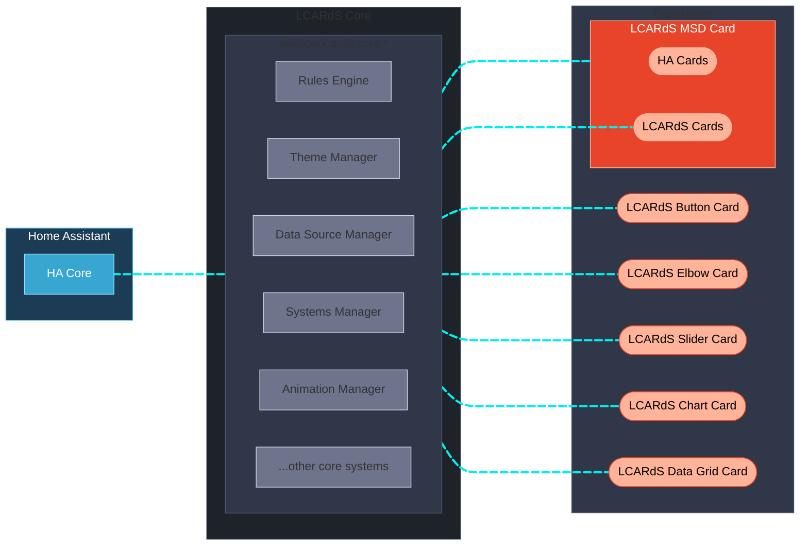

```mermaid
graph LR
    subgraph HA["Home Assistant"]
        HACore[HA Core]
    end

    subgraph CORE["LCARdS Core"]
       subgraph CoreSystems["window.lcards.core.*"]
            direction LR
            CoreRules[Rules Engine]:::coreStyle
            CoreThemes[Theme Manager]:::coreStyle
            CoreData[Data Source Manager]:::coreStyle
            CoreSystemsMgr[Systems Manager]:::coreStyle
            CoreAnim[Animation Manager]:::coreStyle
            CoreOther[...other core systems]:::coreStyle
        end
    end

    subgraph DASHBOARD["Dashboard"]
        Button([LCARdS Button Card]):::lcardsStyle
        Elbow(["LCARdS Elbow Card"]):::lcardsStyle
        Slider([LCARdS Slider Card]):::lcardsStyle
        Chart([LCARdS Chart Card]):::lcardsStyle
        Grid([LCARdS Data Grid Card]):::lcardsStyle
        subgraph MSD[LCARdS MSD Card]
            Card1([HA Cards]):::lcardsStyle
            MSDLCARdS([LCARdS Cards]):::lcardsStyle
        end
    end

    HACore 0@-..-CoreSystems
    CoreSystems 1@-...- Button
    CoreSystems 2@-.- Slider
    CoreSystems 3@-.- Chart
    CoreSystems 4@-.- Elbow
    CoreSystems 5@-.- Grid
    CoreSystems 6@-.- MSD
    CoreSystems 7@-.- MSDLCARdS

    0@{ animate: slow }
    1@{ animate: slow }
    2@{ animate: slow }
    3@{ animate: slow }
    4@{ animate: slow }
    5@{ animate: slow }
    6@{ animate: slow }
    7@{ animate: slow }

    linkStyle 0,1,2,3,4,5,6,7 stroke:#00eeee,stroke-width:3px
   
    classDef lcardsStyle fill:#ffb399,stroke:#e7442a,color:#000
    classDef coreStyle fill:#6d748c,stroke:#d2d5df

    style HA fill:#1c3c55,stroke:#37a6d1,color:#fff
    style HACore fill:#37a6d1,stroke:#93e1ff,color:#fff

    style CORE fill:#1e2229,stroke:#2f3749
    style CoreSystems fill:#2f3749,stroke:#52596e

    style DASHBOARD fill:#2f3749,stroke:#52596e
    style MSD fill:#e7442a,stroke:#ffb399,color:#fff
```
