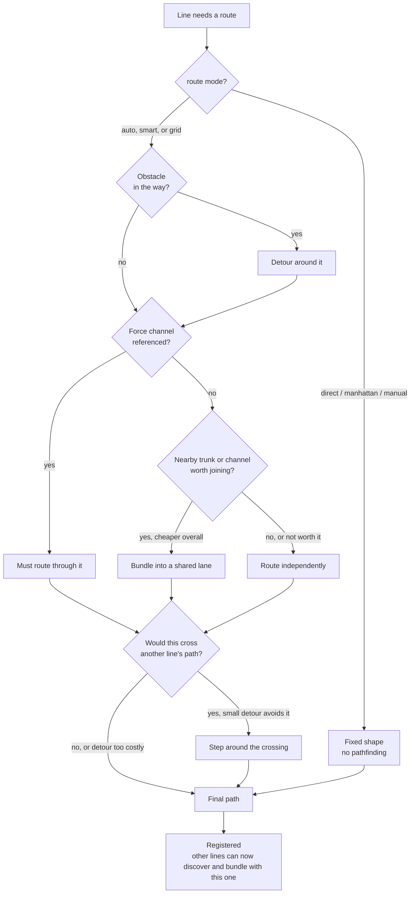

# Routing Concepts

MSD lines route themselves like **cable raceways** on a circuit board: they find their own way around obstacles, bundle together when they're heading the same direction, and avoid cutting across each other when a small detour is cheap enough. This page is the short version of *how the router decides a path* — a mental model, not the full config reference.

::: tip Just want the config knobs?
This page explains the concepts. For every mode, field, and tunable default, see [Line Routing & Channels](./routing.md).
:::

---

## The Decision Flow

For every line, on every recompute, the router works through the same sequence:

Two things worth calling out that a flowchart's yes/no boxes can't fully capture: bundling and crossing-avoidance are always **cost comparisons**, never hard rules — a line only joins a bundle or takes a detour when doing so is genuinely cheaper than the alternative. And this whole sequence runs for *every* line, repeatedly, until the arrangement settles — so the order you declared your lines in never affects the outcome.

---

## Obstacles

Any control with `obstacle: true` is something every `auto`/`smart`/`grid` line routes around automatically — no per-line config needed.

---

## Automatic Bundling

Lines heading the same general direction, running close enough to each other, merge into a shared corridor — riding evenly-spaced lanes — and branch apart again where their destinations actually diverge. This is entirely automatic: no channel, no config, just lines that happen to be going the same way.

---

## Channels

A channel is an **authored** corridor — a region you draw yourself that lines are rewarded for traveling through (`mode: prefer`), penalized for entering (`avoid`), or required to use (`force`). Where automatic bundling only happens between lines that are already naturally close, a channel can pull a line off a path it wouldn't otherwise take, when the discount makes it worthwhile.

---

## Crossing Avoidance

A line's path is penalized for cutting across another already-routed line's segment. It's a deterrent, not a wall — when stepping around is cheap, the router takes the detour; when the only alternative is a long way around, it crosses cleanly instead.

---

## Where to Go Next

- [Line Routing & Channels](./routing.md) — every mode, field, and tunable default
- [Line Overlay](./line-overlay.md) — per-line properties, styling, markers
- [MSD Quick Start](./quick-start.md) — build your first MSD, UI-only
- [Routing Engine Architecture](../../architecture/msd/routing.md) — internals: registries, lane assignment, the discovery loop
