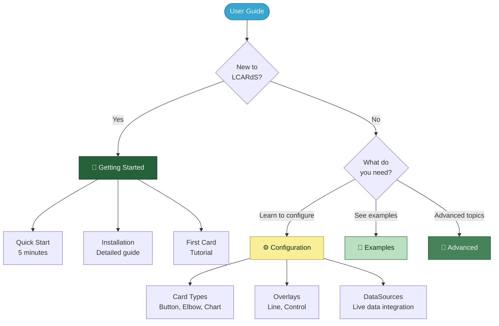

# LCARdS User Guide

> **Complete guide to creating LCARS dashboards**
> Everything you need to build beautiful, functional LCARS interfaces in Home Assistant.

---

## 🎯 Quick Navigation

---

## 🚀 Getting Started

**New to LCARdS?** Start here:

| If you want to... | Go here |
|-------------------|---------|
| ⚡ **Get started fast** | [Quick Start](getting-started/quickstart.md) - 5 minute setup |
| 📦 **Install LCARdS** | [Installation Guide](getting-started/installation.md) - HACS or manual |
| 🎓 **Learn step-by-step** | [First Card Tutorial](getting-started/first-card.md) - Build your first card |

---

## 🎴 Card Types

Learn about each LCARdS card:

| Card | Description | Guide |
|------|-------------|-------|
| 🔘 **Button** | SVG-based button with presets | [Button Guide](cards/button.md) |
| 🔲 **Elbow** | LCARS corners and headers | [Elbow Guide](cards/elbow.md) |
| 🎚️ **Slider** | Interactive sliders/gauges | [Slider Guide](cards/slider.md) |
| 📊 **Chart** | ApexCharts integration | [Chart Guide](cards/chart.md) |
| 📋 **Data Grid** | Tabular data display | [Data Grid Guide](cards/data-grid.md) |

See [Cards Overview](cards/README.md) for comparison and quick start.

---

## ⚙️ Configuration

Core configuration topics:

### Data Integration

| Topic | Description | Guide |
|-------|-------------|-------|
| 📡 **DataSources** | Connect entity data to cards | [DataSource Guide](configuration/datasources.md) |
| 📜 **Rules** | Conditional styling and behavior | [Rules Guide](configuration/rules.md) |
| 📝 **Templates** | Dynamic values with templates | [Template Conditions](configuration/template-conditions.md) |

### MSD Overlays

| Overlay Type | Description | Guide |
|--------------|-------------|-------|
| ➖ **Line** | Visual connections | [Line Overlay](configuration/overlays/line-overlay.md) |
| 🎮 **Control** | Embed HA cards | [Control Overlay](configuration/overlays/control-overlay.md) |

See [Overlays Overview](configuration/overlays/README.md) for complete details.

---

## 📖 Guides & Examples

Practical tutorials and real-world examples:

- **[Guides & Examples](guides/README.md)** - Animation guide, DataSource examples, YAML configs
- **[DataSource Examples](guides/datasource-examples.md)** - Temperature monitoring, power dashboards, environmental sensors
- **[Animation Guide](guides/animations.md)** - Alert modes, pulsing, cascades, custom animations

---

## 📚 Reference

In-depth documentation for lookup:

- **[Presets](reference/presets/)** - Animation, component, and style presets
- **[DataSources](reference/datasources/)** - Transformations, aggregations, computed sources (50+ operations)
- **[Advanced Features](reference/advanced-features/)** - Bulk selectors, SVG filters, segmented elbows
- **[Advanced Topics](reference/advanced/)** - Console API, MSD controls, themes, configuration layers, validation
- **[Pack Explorer](reference/pack-explorer.md)** - Visual asset browser

See [Reference Overview](reference/README.md) for complete index.
| 🎬 **Animations** | [Animation Guide](guides/animations.md) |
| 🎭 **Animation Presets** | [Animation Presets](reference/animation-presets.md) |
| 📊 **Bar Label Presets** | [Bar Labels](reference/bar-label-presets.md) |
| 🧩 **Component Presets** | [Components](reference/component-presets.md) |
| 🔀 **Segment Animations** | [Segment Guide](reference/segment-animation-guide.md) |
| 📦 **Segment Entity States** | [Entity States](reference/segment-entity-states-quick-reference.md) |
| 🔲 **Segmented Elbow** | [Anatomy Guide](configuration/segmented-elbow-anatomy.md) |
| 🖼️ **SVG Filters** | [SVG Filters](configuration/base-svg-filters.md) |

---

## 🆘 Getting Help

| Problem | Solution |
|---------|----------|
| Card not loading | Check [Installation Guide](getting-started/installation.md) |
| Entity not updating | See [DataSources Guide](configuration/datasources.md) |
| Style not applying | Review [Style Priority](reference/advanced/style-priority.md) |
| YAML errors | Check [Validation Guide](reference/advanced/validation_guide.md) |

**Resources:**
- 📖 **This User Guide** - Comprehensive documentation
- 🏗️ **[Architecture Docs](../architecture/)** - System design (for developers)
- 🐛 **[GitHub Issues](https://github.com/snootched/LCARdS/issues)** - Bug reports, questions

---

**Welcome to LCARdS!** 🖖

Start your journey with the [Quick Start Guide](getting-started/quickstart.md) and build your own LCARS interface today!

---

**Navigation:**
- 🏠 [Main Documentation](../README.md)
- 🏗️ [Architecture Docs](../architecture/)
